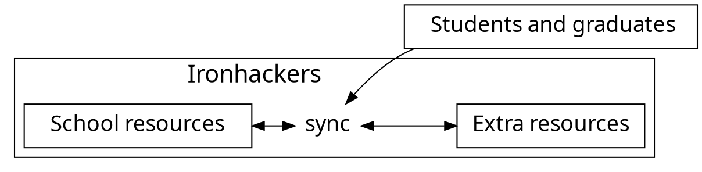

# Ironhackers

You can check it out [here!!!](https://enigmatic-hamlet-57213.herokuapp.com/) :paw_prints:

---

---

## What is Ironhackers?

This is a *platform proposal* that intends to complement all the educative resources and optimize the socialization.

---

### For **Ironhackers** only
It have been developed to be use **only by Ironhackers**, and it's really simple and easy to use.

To activate your account in this private social media, you have to be registered before in the students database from Ironhack.

---

---

### Centralizing resources

---

<iframe width="560" height="315" src="https://www.youtube.com/embed/26EreqlLClI" frameborder="0" allow="accelerometer; autoplay; encrypted-media; gyroscope; picture-in-picture" allowfullscreen></iframe>

By giving each Ironhack a profile within an internal social network, it becomes possible to centralize all the necessary tools for the community, such as a communication space, called *Agora*, educative resources, and a list of all Ironhackers with a view of their profiles so that they can be in touch. 

---

### Educative Resources

---

Ironhackers is intended to keep students and graduates in constant communication as well as give them access to the constant change of technology.

This is achieved by linking the "Ironhack's learnings" with extra resources, giving the opportunity to improve the training of the Ironhackers.

---

### Thank you! 

Authors:

* [deredhuzent](https://github.com/deredhuzent)
* [Victoria.plp](https://github.com/VictoriaPl)
